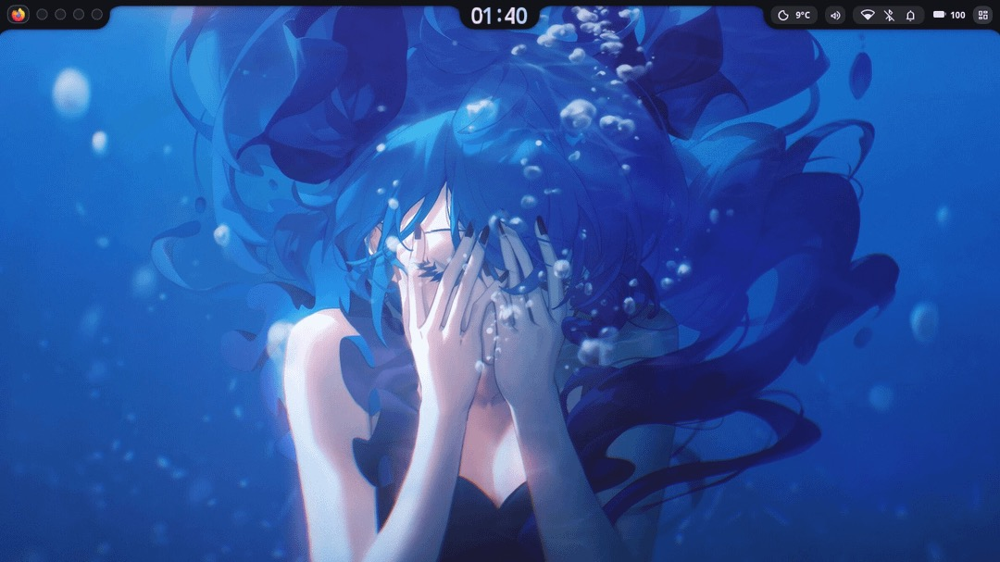
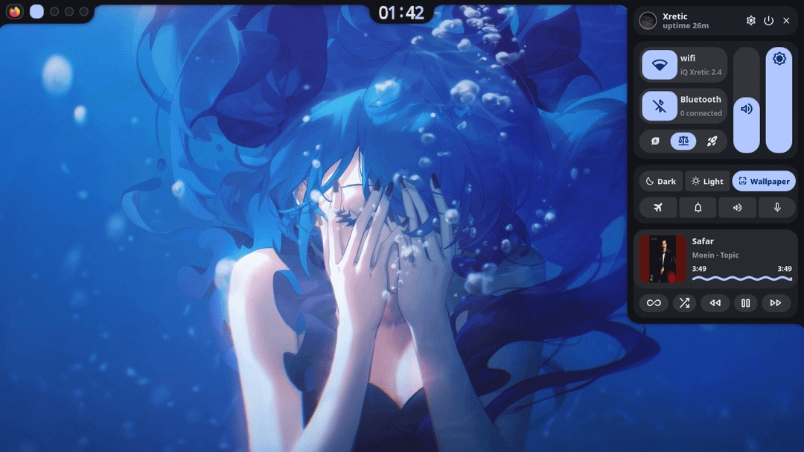
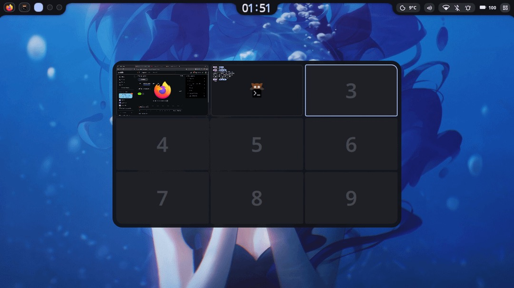
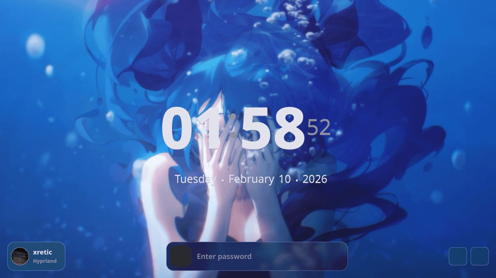

# ✦ Celona Shell ✦

  
  
  
  &nbsp;
  

---
<h2 align="center">✦ Overview ✦ </h2>

#### An Extremely Customizable Shell.

> [!IMPORTANT]
> * **Before reporting an issue:**
  If you encounter a problem in the current release, please first test against the latest source code by cloning the repository (`git clone ...`). This ensures you are not reporting an issue that has already been fixed.
  Only open an issue if the problem is still reproducible on the latest source.

---

<h2 align="center">✦ Previews ✦</h2>

| Top Bar                                         | Quick Settings                                           |
|--------------------------------------------------|----------------------------------------------------|
|                        |                         |
| **OverView**                                         | **Lock Screen**                                           |
|                        |                         |

