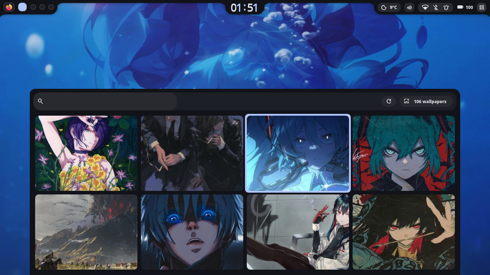
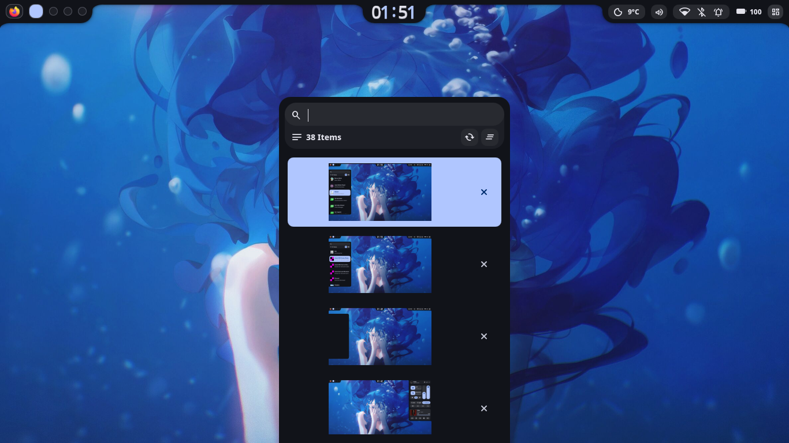
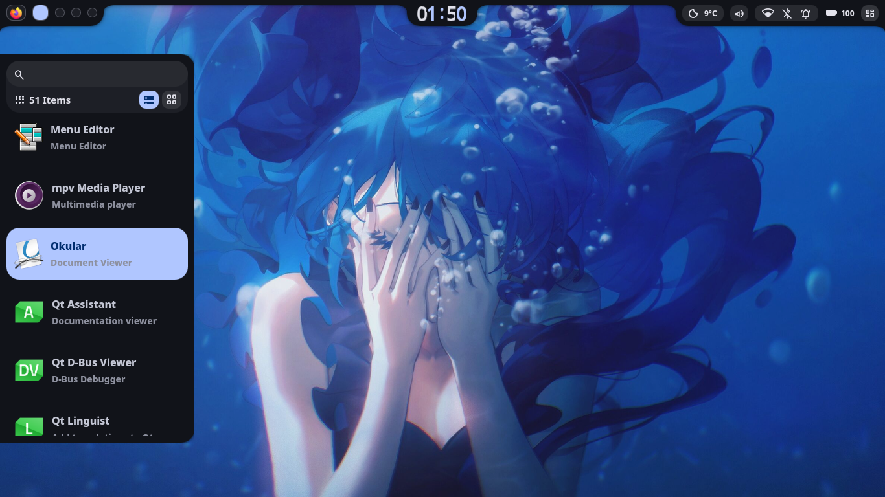

<div align="center">

# ✦ Celona Shell ✦

<p>
  
  
  
  &nbsp;
  
</p>

</div>

---
<h2 align="center">✦ Overview ✦ </h2>

#### An Extremely Customizable Shell.

> [!IMPORTANT]
> * **Before reporting an issue:**
  If you encounter a problem in the current release, please first test against the latest source code by cloning the repository (`git clone ...`). This ensures you are not reporting an issue that has already been fixed.
  Only open an issue if the problem is still reproducible on the latest source.

---

<h2 align="center">✦ Previews ✦</h2>


<div align="center">

<table>
  <tr>
    <th>Top Bar</th>
    <th>Quick Settings</th>
  </tr>
  <tr>
    <td></td>
    <td></td>
  </tr>
  <tr>
    <td><b>OverView</b></td>
    <td><b>Lock Screen</b></td>
  </tr>
  <tr>
    <td></td>
    <td></td>
  </tr>
  <tr>
    <td><b>Wallpaper Selector</b></td>
    <td><b>Clipboard</b></td>
  </tr>
  <tr>
    <td></td>
    <td></td>
  </tr>
  <tr>
    <th colspan="2">App Launcher</th>
  </tr>
  <tr>
    <td colspan="1">
      
    </td>
  </tr>
</table>


</div>


<h2 align="center">✦ Installation ✦</h2>

Follow these steps to install the collection. The automated setup is conservative and will prompt before making destructive changes.

### Using The Install Script
```bash
git clone https://github.com/unf6/celona
cd celona
cd install
./install.sh
```

Notes:
- Manual installation (symlinking files yourself) is supported and recommended for cautious users.
- Back up your existing dotfiles (e.g. ~/.config/ ~/.bashrc, ~/.zshrc, ~/.profile) before running the bootstrap.
